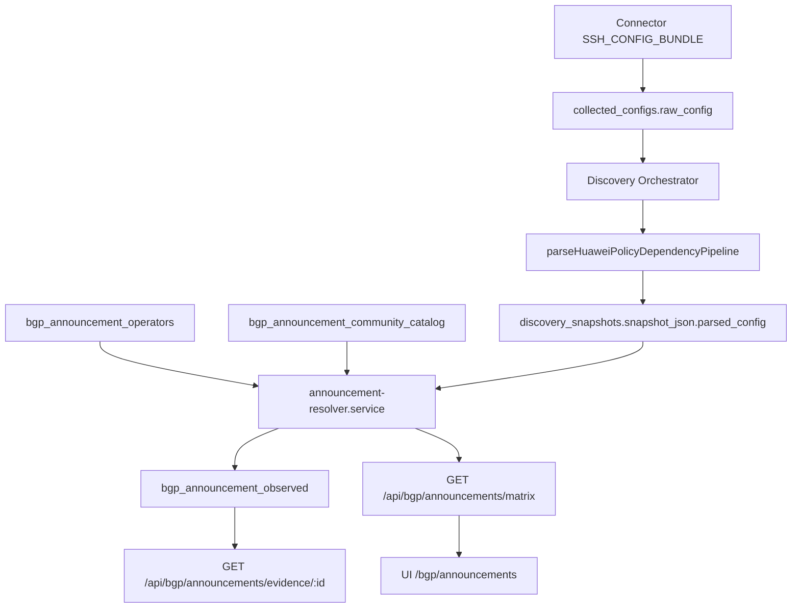

# BGP Announcement Matrix — Integration Map

Data: 2026-06-06  
Escopo: Fase 0 — alinhamento antes da implementação do módulo `bgp-announcement-matrix`.

> **MVP read-only fechado:** ver [`BGP_ANNOUNCEMENT_MVP_READONLY_CLOSURE.md`](./BGP_ANNOUNCEMENT_MVP_READONLY_CLOSURE.md)

## 1. Objetivo

Documentar **onde plugar** o novo módulo no pipeline existente do 114-4WNET-NetOps, sem duplicar parsers, coleta ou resolvers já entregues.

Princípio:

```text
Connector → SSH_CONFIG_BUNDLE → Huawei VRP parsers → Policy Dependency Pipeline → [NOVO] Announcement Resolver → Matrix API → UI
```

---

## 2. Correção de paths (spec vs repo)

A spec original referencia `workspace/apps/api` e `workspace/apps/web`. Neste repositório:

| Spec | Path real |
|------|-----------|
| Backend API | `workspace/artifacts/api-server/src/modules/` |
| Frontend | `workspace/artifacts/netops-manager/src/` |
| Schema / migrations | `workspace/lib/db/src/schema/`, `workspace/lib/db/migrations/` |
| OpenAPI | `workspace/lib/api-spec/openapi.yaml` |
| Próxima migration | `0041_*` (última existente: `0040_bgp_peer_collection_history.sql`) |

Módulo sugerido:

```text
workspace/artifacts/api-server/src/modules/bgp-announcements/
workspace/artifacts/netops-manager/src/features/bgp-announcements/
workspace/artifacts/netops-manager/src/pages/bgp-announcements.tsx
```

Registro de rotas (fase wiring — 2026-06-10):

- API: `workspace/artifacts/api-server/src/routes/index.ts` → `bgpAnnouncementRouter`
- Feature flag: `GET /bgp/announcements/feature` + `BGP_ANNOUNCEMENT_MATRIX_ENABLED` (default true)
- UI: `App.tsx` → `/bgp-announcements` (redirect para NetOps Operations com `view=bgp-announcements`)
- Menu: `layout.tsx` → BGP Announcements

Snapshot refresh (fase DATA-SNAPSHOT-REFRESH — 2026-06-10):

- `POST /bgp/announcements/snapshots/refresh` — recompila matriz a partir do banco (sem SSH/SNMP)
- `GET /bgp/announcements/snapshots/latest|/:id` — leitura de snapshots append-only
- UI: **Recarregar** = refetch; **Atualizar matriz** = POST refresh; aba **Histórico**

Visão semântica (fase MATRIX-SEMANTIC-VIEW — 2026-06-10):

- `semantic-dependency-classifier.ts` — targetRole, targetEditMode, dependencyScope, dependencyProtection
- `semantic-matrix-view.service.ts` — `semanticView` no read model da matriz
- UI tabs: Clientes/ORIGIN · Auditoria Upstreams · Dependências Globais · Conflitos · Histórico

---

## 3. Pipeline de coleta existente

### 3.1 Connector + config bundle

| Componente | Path | Papel |
|------------|------|-------|
| Job type | `SSH_CONFIG_BUNDLE` | `connector-execution.service.ts` |
| Comandos Huawei | `connector-config-collect.service.ts` → `HUAWEI_SSH_CONFIG_BUNDLE_COMMANDS` | `display current-configuration`, `display bgp peer`, etc. |
| Persistência | `collected_configs` (`source = connector_ssh_bundle`) | `raw_config` = bundle multi-comando |
| Parser bundle | `config-backup/config-bundle-parser.service.ts` | `splitCommandBundle()` |

**Gap para MVP:** o bundle atual **não inclui** comandos dedicados de policy (`display current-configuration configuration route-policy`, `include large-community`). Para MVP 1 isso é aceitável — `display current-configuration` já traz route-policies, ip-prefix e communities embutidos. Comandos adicionais podem entrar numa fase posterior sem novo job type.

### 3.2 Device discovery (fonte primária da matriz)

| Etapa | Path |
|-------|------|
| Orquestrador | `modules/netops/device-discovery/discovery.orchestrator.ts` |
| SSH collector | `device-discovery/collectors/ssh.collector.ts` |
| Reuso bundle | `loadLatestConnectorBundle()` quando device usa connector |
| Persistência | `discovery_runs`, `discovery_snapshots.snapshot_json`, `discovery_evidence` |

Fluxo relevante (`CollectionOrchestrator.collect`):

1. Coleta SSH (+ SNMP opcional + cached config).
2. `normalizeDiscoveryPolicies()` → `policies`, `prefixLists`, `ipv6PrefixLists`, …
3. `parseHuaweiPolicyDependencyPipeline(policyPipelineText)` → `parsed_config`.
4. Enriquece peers e monta `bgp_policy_bindings`.
5. Grava snapshot JSON completo em `discovery_snapshots`.

**Fonte recomendada para MVP 1:** último `discovery_snapshots` por device (ou `parsed_config` reconstruído via `buildPolicyDependencyConfigFromSnapshot()`).

### 3.3 Idade da coleta

| Fonte | Campo de freshness |
|-------|-------------------|
| Discovery snapshot | `discovery_snapshots.created_at` |
| Config bundle | `collected_configs.collected_at` |
| Evidence por contexto | `discovery_evidence.finished_at` |

Regra sugerida (`BGP_ANNOUNCEMENT_MAX_COLLECTION_AGE_MINUTES=30`) aplica-se ao snapshot usado pelo resolver.

---

## 4. Parsers Huawei VRP existentes

| Parser | Path | Output |
|--------|------|--------|
| Route policies + ip-prefix + applies | `huawei-vrp/parsers/policy-parser.ts` | `NetopsFilter[]` |
| Community-filter / community-list | `huawei-vrp/parsers/community-parser.ts` | `NetopsCommunity[]` |
| Policy dependency pipeline | `huawei-vrp/parsers/policy-dependency-pipeline.ts` | `ParsedPolicyDependencyConfig` |
| BGP peer + peer-group bindings | `huawei-vrp/parsers/bgp-peer-dependency-parser.ts` | `ParsedHuaweiBgpPeerDependencyModel` |
| BGP peers operacionais | `huawei-vrp/parsers/bgp-peer-parser.ts` | peers para discovery |

### 4.1 O que já está estruturado

`ParsedPolicyDependencyConfig` (`policy-dependency-pipeline.ts`):

```text
catalogs.community_filters      → ip community-filter (basic/advanced)
catalogs.ip_prefixes            → ip ip-prefix
catalogs.ipv6_prefixes          → ip ipv6-prefix
catalogs.extcommunity_filters   → ip extcommunity-filter
consumers.route_policies        → nodes[] com matches[] e applies[] (strings brutas)
dependency_graph.route_policy_dependencies  → if-match resolvido (FOUND/MISSING/…)
dependency_graph.bgp_policy_bindings      → peer/group → route-policy import/export
bgp_peer_model                  → peer-groups, herança de policy
```

`DeviceDiscoverySnapshot` (`discovery.types.ts`) espelha isso em:

- `policies[]`, `prefixLists[]`, `communities[]`, `parsed_config`, `bgpPeers[]`

### 4.2 Gaps que o novo módulo precisa tratar (sem reinventar parser base)

| Gap | Situação atual | Ação no módulo |
|-----|----------------|----------------|
| `apply large-community` | Linha fica em `node.applies[]` como string bruta; **sem parser dedicado** | Novo helper em `bgp-announcements/` que parseia `apply large-community …` / `undo apply large-community` a partir de `applies[]` |
| Prefixo ↔ route-policy | Resolvido via `route_policy_dependencies` (`if-match ip-prefix X`) | Resolver cruza dependency → entrada do catálogo `ip_prefixes` → CIDR |
| Operadora ↔ community | Não existe | **Novas tabelas** `bgp_announcement_operators` + `bgp_announcement_community_catalog` |
| Estado On/P1/P2/Off | Não existe | **Novo** `announcement-resolver.service.ts` |
| Matriz materializada | Não existe | **Nova** `bgp_announcement_observed` (opcional: rebuild on-read no MVP 1) |

**Regra:** estender parsers Huawei **somente** se o helper de `applies[]` for insuficiente; preferir consumir `parsed_config` existente.

---

## 5. Tabelas e persistência existentes (reuso vs complemento)

### 5.1 Reutilizar (leitura)

| Tabela | Uso para announcement matrix |
|--------|------------------------------|
| `discovery_snapshots` | Fonte canônica de `parsed_config` + policies |
| `discovery_evidence` | Evidência bruta sanitizada por comando |
| `collected_configs` | Running-config / bundle quando snapshot indisponível |
| `devices` | Filtro por equipamento |
| `bgp_peer_role_overrides` | Hint de role/label por peer (não substitui catálogo de operadoras) |
| `operational_bgp_peers` | Estado operacional SNMP (fase futura: “BGP Advertised Confirmed”) |
| `bgp_route_history` | Rotas advertised/received por peer (fase futura) |
| `bgp_peer_drilldown_snapshots` | Drilldown cache — referência para policy drilldown UI existente |
| `audit_logs` | Auditoria global (complementar audits específicos do módulo) |

### 5.2 Relacionadas mas NÃO são o catálogo de operadoras

| Tabela | Propósito atual | Relação com novo módulo |
|--------|-----------------|-------------------------|
| `community_library_items` | Biblioteca de `ip community-filter` por device | **Diferente** — valores descobertos no equipamento, não semântica On/P1/Off por operadora |
| `community_sets` / `community_set_members` | Objetos `ip community-list` editáveis | Reutilizar **padrão** preview/apply/audit; não confundir com matriz |
| `community_change_audit` | Audit preview/apply de community-list | Modelo de referência para audit de change-plans |

### 5.3 Novas tabelas (complementares — spec MVP)

| Tabela | Migration sugerida |
|--------|-------------------|
| `bgp_announcement_operators` | `0041_bgp_announcement_operators.sql` |
| `bgp_announcement_community_catalog` | `0041_*` (mesma migration) |
| `bgp_announcement_observed` | `0041_*` |
| `bgp_announcement_change_plans` | `0042_bgp_announcement_change_plans.sql` (MVP 2) |

Drizzle: `workspace/lib/db/src/schema/bgp_announcements.ts` + export em `schema/index.ts`.

---

## 6. Resolvers e serviços existentes (ponto de encaixe)

### 6.1 Policy dependency resolver (já entregue)

```text
parseHuaweiPolicyDependencyPipeline(configText)
buildPolicyDependencyConfigFromSnapshot(snapshot)
resolveRoutePolicyDependency(config, dep)
buildBgpPolicyBindings(config, peers, policies)
buildBgpPolicyBindingsFromPeerModel(bgpModel, routePolicies, …)
```

**Encaixe:** `announcement-resolver.service.ts` recebe `ParsedPolicyDependencyConfig` + catálogo DB e produz células `{ prefix, operator, state, evidence }`.

### 6.2 BGP drilldown / policy editor (referência UX + preview)

| Serviço | Path | Reuso |
|---------|------|-------|
| Drilldown builder | `modules/bgp-drilldown/bgp-peer-drilldown.builder.ts` | Padrão de evidência por policy/node |
| Policy editor preview | `modules/bgp-drilldown/bgp-policy-editor.service.ts` | Padrão preview a partir de drilldown + community sets |
| Policy editor utils | `modules/bgp-drilldown/bgp-policy-editor.utils.ts` | Compilação de blocos VRP |

**Diferença:** policy editor é **por peer**; announcement matrix é **por prefixo × operadora** com catálogo semântico.

### 6.3 Community apply (controlled execution existente)

| Serviço | Path | Padrão |
|---------|------|--------|
| Preview + apply gate | `community-apply.service.ts` | `CONFIG_APPLY_ENABLED` → 503 |
| Sync from config | `community-sync.service.ts` | Import running-config → library/sets |
| Rotas | `community.routes.ts` | `/devices/:id/community-sets/.../preview` |

**Encaixe MVP 2:** `announcement-compiler.service.ts` segue o mesmo contrato: preview gera script, apply bloqueado, audit em tabela dedicada.

### 6.4 Provisioning controlled execution

| Item | Path / tabela |
|------|---------------|
| Flags | `env.ts`: `provisioningExecuteEnabled`, `provisioningRequireApproval` |
| Approval fields | `provisioning_jobs` (migration `0029_provisioning_controlled_execution.sql`) |
| Preview engine | `modules/provisioning/provisioning-preview.service.ts` |

**Encaixe MVP 3:** `bgp_announcement_change_plans` espelha status draft → approved → executed; execução via **Connector** (não SSH direto da API).

---

## 7. API e rotas existentes (BGP)

| Prefixo | Router | Notas |
|---------|--------|-------|
| `/api/netops/...` | `modules/netops/routes.ts` | Inventário, communities legacy |
| `/api/discovery/...` | `device-discovery/discovery.routes.ts` | Runs, snapshots |
| `/api/devices/:id/community-sets/...` | `community.routes.ts` | Sets preview/apply |
| `/api/operational/bgp/...` | `operational-bgp/` | SNMP_FAST peers |
| `/api/bgp/peer-drilldown/...` | `bgp-drilldown/` | Drilldown cache |
| `/api/bgp/cleanup/...` | `bgp-drill-cleanup/` | Cleanup planner |

**Novos endpoints (spec):** montar router em `bgp-announcements/announcement-matrix.routes.ts` e registrar em `routes/index.ts`:

```text
GET  /api/bgp/announcements/matrix
GET  /api/bgp/announcements/operators
GET  /api/bgp/announcements/community-catalog
GET  /api/bgp/announcements/evidence/:id
POST /api/bgp/announcements/preview-change        (MVP 2)
POST /api/bgp/announcements/change-plans          (MVP 2)
```

OpenAPI: atualizar `workspace/lib/api-spec/openapi.yaml` + regerar Orval.

---

## 8. Frontend existente (padrão visual)

| Área | Path | Relação |
|------|------|---------|
| Communities (legacy layout) | `features/communities/communities-placeholder-panel.tsx` | Referência de densidade/tabs do `60-bgp_manager` |
| Community library/sets | `features/bgp/community-library-tab.tsx`, `community-sets-tab.tsx` | Tabs por device |
| Operational BGP | `pages/operational-bgp.tsx` | SNMP peers |
| BGP drilldown | `pages/bgp-peer-drilldown.tsx` | Policy drilldown + editor |
| Policy editor modal | `features/bgp-policy-editor/` | Preview local + backend |

**Nova página:** `/bgp/announcements` — menu sob **BGP > Gestão de Anúncios**.

Componentes sugeridos seguem skill `frontend-feature` e padrão dark/shadcn das páginas acima.

---

## 9. RBAC, flags e auditoria

### 9.1 RBAC atual

- `lib/auth.ts` → `requirePermission("domain.action")`
- Roles: `viewer`, `operator`, `admin` com defaults em `getDefaultPermissions()`

**Permissões novas sugeridas:**

```text
bgp_announcements.read
bgp_announcements.preview
bgp_announcements.plan
bgp_announcements.approve   (admin, MVP 3)
bgp_announcements.execute   (admin, MVP 3, flag OFF)
```

### 9.2 Feature flags (adicionar em `env.ts`)

```text
BGP_ANNOUNCEMENT_MATRIX_ENABLED=true      (default true em lab)
BGP_ANNOUNCEMENT_PREVIEW_ENABLED=true
BGP_ANNOUNCEMENT_EXECUTION_ENABLED=false
BGP_ANNOUNCEMENT_MAX_COLLECTION_AGE_MINUTES=30
```

Gate pattern: seguir `*.gate.ts` de `operational-bgp` (503 quando disabled).

### 9.3 Auditoria

- Global: `logAuditEvent()` em `lib/audit.js`
- Específica MVP 2: `bgp_announcement_change_plans` + eventos `announcement_preview_created`, `announcement_plan_created`, `announcement_script_copied`

---

## 10. Fluxo de dados proposto (MVP 1)



### Algoritmo do resolver (resumo)

1. Para cada `route_policy` em `parsed_config.consumers.route_policies`:
2. Para cada `node` com action `permit`:
3. Resolver prefixo via `route_policy_dependencies` → `ip-prefix` / `ipv6-prefix` catalog entry.
4. Extrair communities de `node.applies[]` (`apply community`, `apply large-community`, etc.).
5. Para cada community value, lookup em `bgp_announcement_community_catalog` → `(operator, action, prepend_count)`.
6. Communities não mapeadas → estado `Unknown` (nunca `Off`).
7. Múltiplas actions conflitantes → `Conflict`.
8. Policy usada por >1 prefixo → flag `Shared` + risk elevation.
9. Persistir / retornar célula com `evidence_json` (policy, node, raw lines, source, collected_at).

---

## 11. Fluxo MVP 2 (preview — sem execução)

```text
UI edit cell → POST preview-change
  → announcement-compiler.service
      valida: policy exists, node exists, catalog match, collection age, shared policy
      preserva communities desconhecidas na linha apply
      gera: script, rollback, diff_json, risk_level
  → audit + optional POST change-plans (status=draft)
```

Referência de compilação VRP: `community-apply.service.ts` + spec §19 (reconstrução `undo apply large-community` + `apply … additive`).

Execução real: **stub 503** enquanto `BGP_ANNOUNCEMENT_EXECUTION_ENABLED=false`.

---

## 12. Selftests (mapear fixtures existentes)

| Selftest novo | Fixtures / dependências |
|---------------|-------------------------|
| `bgp-announcement-community-resolver-selftest.mjs` | Sample `parsed_config` ou texto VRP inline |
| `bgp-announcement-matrix-selftest.mjs` | Resolver + catálogo seed |
| `bgp-announcement-semantic-view-selftest.mjs` | Semântica MATRIX-SEMANTIC-VIEW |
| `bgp-announcement-change-preview-selftest.mjs` | CHANGE-PREVIEW read-only |
| `bgp-announcement-change-plan-link-selftest.mjs` | CHANGE-PLAN-LINK draft |
| `bgp-announcement-risk-selftest.mjs` | Regras §17 |
| `bgp-announcement-shared-policy-selftest.mjs` | Multi-prefix same policy |

Fixtures Huawei existentes: `modules/netops/huawei-vrp/` tests inline, compliance `bgp-checks.ts` (usa `parsed_config`).

---

## 13. Riscos de integração identificados

| Risco | Mitigação |
|-------|-----------|
| `large-community` não parseada estruturalmente | Helper dedicado; testes com fixtures reais |
| Catálogo de operadoras vazio → tudo Unknown | Seed lab + UI de catálogo (Fase 1) |
| Confundir `community_library_items` com catálogo semântico | Nomenclatura clara na UI (“Operadoras” vs “Biblioteca filter”) |
| Policy compartilhada | Detector via contagem prefixos/policy; warning + block exec |
| Coleta stale | Gate em preview; badge na matriz |
| Spec migration 0032/0033 | Usar `0041`/`0042` — numeração atual do repo |

---

## 14. Ordem de implementação confirmada

1. ✅ **Integration Map** (este documento)
2. Migration catálogos + seed lab
3. `announcement-resolver.service.ts` + selftest resolver
4. Matrix API (read-only)
5. UI `/bgp/announcements` + evidence panel
6. Preview compiler + diff/rollback (MVP 2)
7. Change plans draft (MVP 2)
8. Execução via Connector (MVP 3, flag OFF)
9. ✅ **CHANGE-PREVIEW** — ver [`BGP_ANNOUNCEMENT_CHANGE_PREVIEW.md`](./BGP_ANNOUNCEMENT_CHANGE_PREVIEW.md)
10. ✅ **CHANGE-PLAN-LINK** — `announcement-change-plan-link.service.ts`, adapter `bgp-announcement-preview.adapter.ts`, migration `0050` — ver [`BGP_ANNOUNCEMENT_CHANGE_PLAN_LINK.md`](./BGP_ANNOUNCEMENT_CHANGE_PLAN_LINK.md)
11. ✅ **CHANGE-PLAN-REVIEW-WORKFLOW** — `change-plan-review.service.ts`, UI `/change-plans`, migration `0051` — ver [`BGP_ANNOUNCEMENT_CHANGE_PLAN_REVIEW_WORKFLOW.md`](./BGP_ANNOUNCEMENT_CHANGE_PLAN_REVIEW_WORKFLOW.md)
11. ✅ **MVP READ-ONLY CLOSURE** — [`BGP_ANNOUNCEMENT_MVP_READONLY_CLOSURE.md`](./BGP_ANNOUNCEMENT_MVP_READONLY_CLOSURE.md)

---

## 15. Checklist de início de coding

- [ ] Criar schema Drizzle + migration `0041`
- [ ] Seed operadoras/communities de lab
- [ ] Implementar parser helper `extractApplyCommunities(applies[])` incluindo large-community
- [ ] Implementar resolver + materialização observed
- [ ] Registrar rotas + OpenAPI + gate + permissions
- [ ] Página UI read-only
- [ ] Selftests Fase 1 antes de merge
