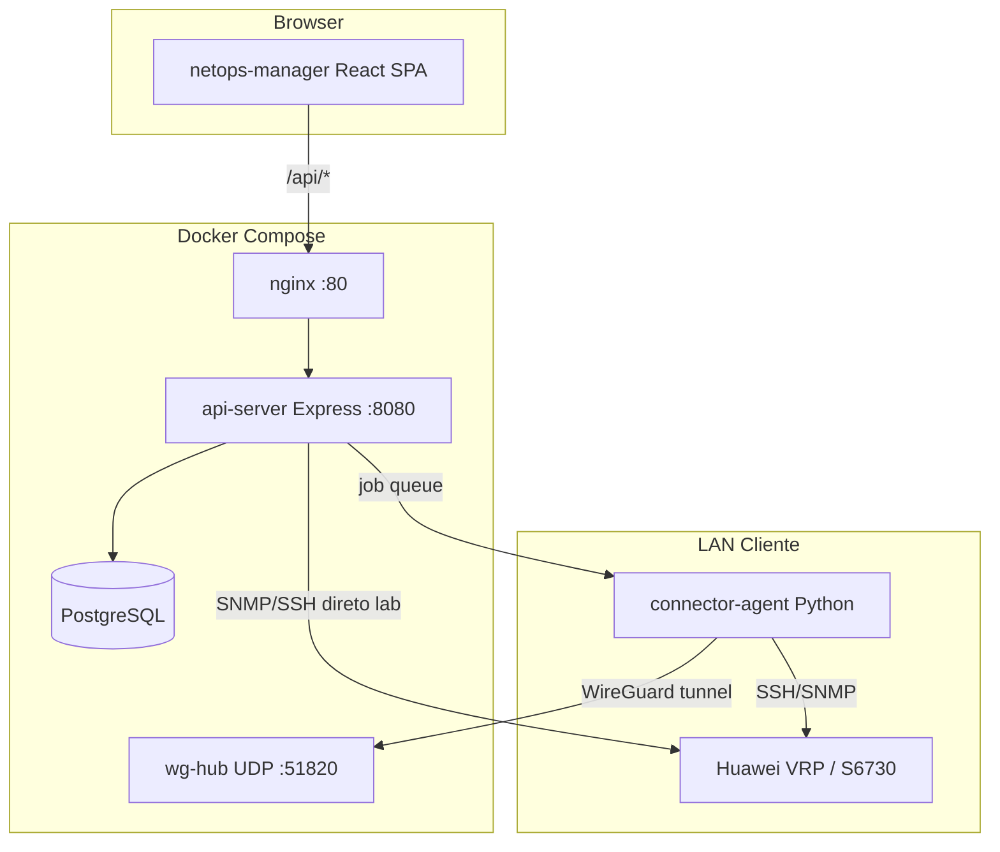

# Arquitetura — 114-4WNET-NetOps

## Visão em camadas



## Monorepo (`workspace/`)

```
workspace/
├── artifacts/
│   ├── api-server/     # Backend Express
│   ├── netops-manager/ # Frontend SPA
│   └── mockup-sandbox/ # Protótipos UI isolados
└── lib/
    ├── db/             # Drizzle + migrations
    ├── api-spec/       # OpenAPI source
    ├── api-zod/        # Zod gerado
    └── api-client-react/ # Hooks React Query gerados
```

**Pipeline de contrato:** editar `openapi.yaml` → Orval → client + zod → consumo no frontend.

## Backend (`api-server`)

- **Build:** esbuild → `dist/index.mjs` (single bundle)
- **Mount:** `/api` prefix
- **Auth:** cookie session + RBAC permissions (`lib/auth.ts`)
- **Middleware:** `requestContextMiddleware`, `authorizeRequest` (pós rotas públicas)

### Rotas públicas
- `GET /api/healthz`
- `POST /api/auth/login`
- Connector agent: heartbeat, job poll/result (token auth)

### Domínios protegidos
Ver [MODULES.md](./MODULES.md) e `src/routes/index.ts`.

## Frontend (`netops-manager`)

- **Build:** Vite → static assets
- **Serve:** nginx em container `web`, proxy `/api` → `api:8080`
- **State:** React Query (server), localStorage (filtros L2, etc.)

## Infraestrutura

| Componente | Path | Função |
|------------|------|--------|
| Compose | `docker-compose.yml` | Orquestração |
| Dockerfile | `Dockerfile` | Multi-stage api + frontend |
| Nginx | `infra/nginx/default.conf` | SPA + API proxy |
| WG Hub | `infra/wireguard-hub/` | Túnel para connectors |
| Connector agent | `infra/connector-agent/` | Execução remota |
| Bastion deploy | `deploy/bastion/` | Instalação on-prem cliente |

## Modelo de segurança

1. **Provisionamento:** `CONFIG_APPLY_ENABLED=false`, `DRY_RUN_DEFAULT=true`
2. **Coleta direta (lab):** flags SNMP/SSH por feature
3. **Pilot devices:** allowlist CSV para SNMP_FAST e L2 refresh
4. **Connectors:** NetOps nunca SSH direto em produção cliente — só via agent + WG
5. **Huawei SSH:** validação read-only em `validateReadonlyCommand`
6. **Secrets:** `.env`, `wg0.conf`, device passwords encrypted at rest

## CI (`.github/workflows/ci.yml`)

1. `pnpm typecheck` + `pnpm build` em `workspace/`
2. `docker compose config` + `docker build` smoke

## Escalabilidade atual

- Single-node Compose (não K8s)
- Jobs async: discovery L2 fire-and-forget, connector job queue, scheduler
- Sem Redis — estado em Postgres

## Documentação relacionada

- `docs/connectors/ARCHITECTURE.md` — connectors/WG
- `docs/collection/HYBRID_COLLECTION_ARCHITECTURE.md` — SNMP + SSH híbrido
- `docs/l2-circuits/` — L2 MVP e operational refresh
- `docs/frontend/UX_GUARDRAILS.md` — regras UI
