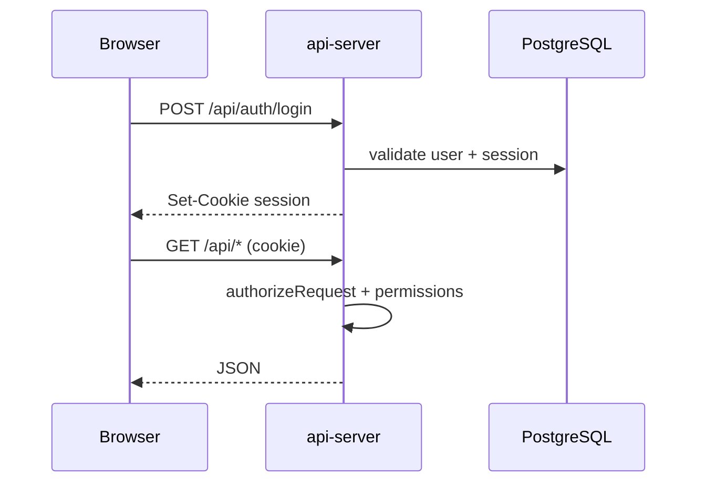
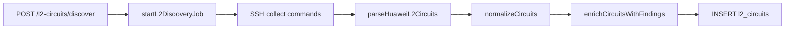
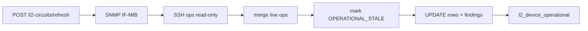
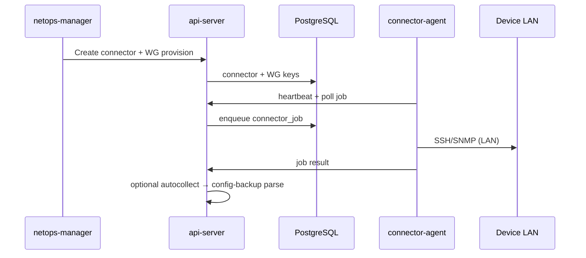

# Fluxos principais

## 1. Autenticação e RBAC



- Permissões: `docs/RBAC_MODEL.md`
- Bootstrap admin: env `ADMIN_*` no primeiro start

---

## 2. L2 Circuits — discovery

**Gate:** `L2_DISCOVER_SSH_ENABLED=true`



**Comandos SSH típicos:** `display mpls l2vc`, `display vsi verbose`, `display current-configuration interface`

**Parser chain:** NE8000 dot-blocks + S6730 dialect + dot1q local

---

## 3. L2 Circuits — refresh operacional

**Gate:** `L2_OPERATIONAL_REFRESH_ENABLED=true` + pilot device



- **Não insere** novos circuitos — só UPDATE
- Findings persistidos; GET respeita refresh timestamp
- Prune inventário: requer novo discovery

---

## 4. SNMP_FAST interfaces

**Gate:** `NETOPS_SNMP_REAL_ENABLED` + pilot

```
POST /api/operational/interfaces/collect { device_id }
  → collectSnmpInterfacesOnly
  → UPSERT operational_interfaces
GET /api/operational/interfaces?device_id=
```

---

## 5. SNMP_FAST BGP

**Gate:** `NETOPS_SNMP_BGP_REAL_ENABLED` + pilot

```
POST /api/operational/bgp/collect { device_id }
  → RFC4273 walk
  → UPSERT operational_bgp_peers
GET /api/operational/bgp?device_id=
```

---

## 6. BGP peer drilldown

```
GET /api/bgp/peers/:deviceId/:peer/drilldown
  → snapshot cache (TTL env)
  → optional SSH detail if BGP_DRILLDOWN_SSH_DETAIL_ENABLED
```

Frontend: `features/bgp-drilldown/`, página `/bgp/peer-drilldown`

---

## 7. Connectors (produção cliente)



**Regra:** API não SSH direto em devices cliente — só via agent.

Lab local pode usar SSH direto em `devices` table.

---

## 8. Compliance

```
POST /api/compliance/jobs → engine → compliance_findings
GET  /api/compliance/findings (filters, export)
```

Engine v2: `docs/COMPLIANCE_ENGINE_V2.md`

---

## 9. Provisioning preview

```
POST /api/provisioning/preview → preview engine (dry-run)
Apply real blocked unless CONFIG_APPLY_ENABLED=true
```

---

## 10. Frontend data flow (padrão)

```
Page → useQuery (api-client-react) → nginx /api → Express → Drizzle → PG
```

Exceção L2: `features/l2-circuits/l2-circuits-api.ts` (fetch manual + React Query)

---

## 11. Docker startup

```
db (healthy) → migrate (drizzle push) → api + web (+ wg-hub)
```

Nginx `web` proxy `/api/` → `http://api:8080`
