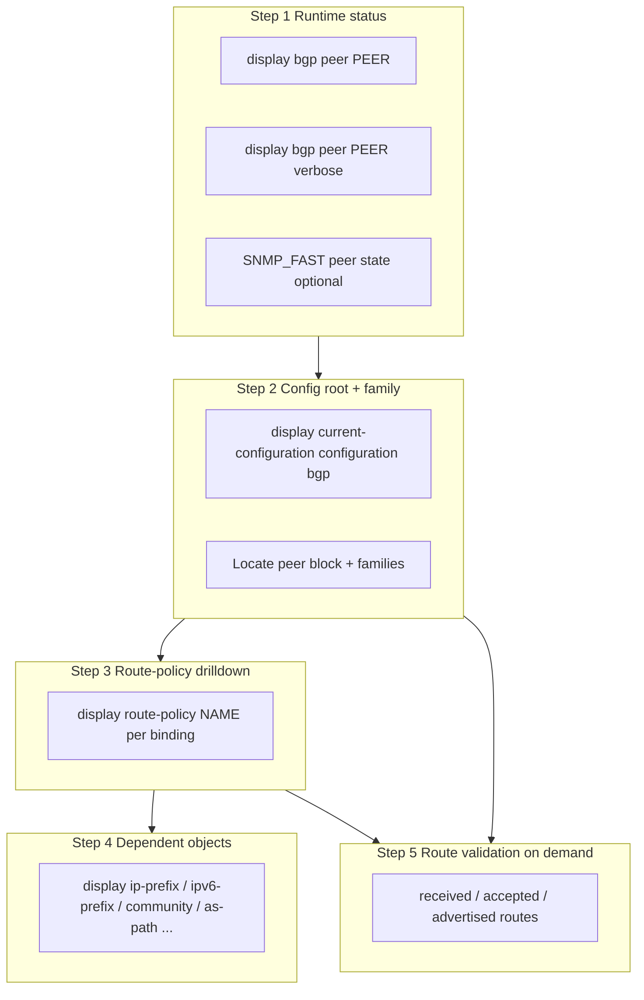

# BGP Peer Drilldown Architecture (Huawei NE8000 / VRP)

**Status:** BGP-D1 — design only (no implementation in this phase)  
**Audience:** NOC, NetOps engineering, compliance (reference only)  
**Related:** `bgp-peer-dependency-parser.ts`, `docs/collection/HYBRID_COLLECTION_ARCHITECTURE.md`, `docs/netops/BGP_OPERATIONAL_ABSTRACTIONS.md`

---

## A) Objective

Provide a **direct, top-down analysis of one BGP peer** on a device — separate from global compliance sweeps.

Engineering and NOC need a single view that answers:

| Layer | Question |
|-------|----------|
| Operational | Is the session up? What are prefix counters? |
| Config root | AS, description, group, connect-interface? |
| Address-family | Which AFI/SAFI is enabled? Import/export policies? |
| Policies | What does each route-policy node match/apply? |
| Dependencies | Which prefix-lists, communities, AS-path filters are referenced? |
| Effectiveness | What routes are received / accepted / advertised? (on demand only) |

**Example (Huawei VRP):**

```text
display this | include 172.28.1.138

peer 172.28.1.138 as-number 262663
peer 172.28.1.138 description WIFIZAO.BRT
 peer 172.28.1.138 enable
 peer 172.28.1.138 route-policy AS262663-WIFIZAO.BRT-Import-IPv4 import
 peer 172.28.1.138 route-policy AS262663-WIFIZAO.BRT-Export-IPv4 export
 peer 172.28.1.138 default-route-advertise
```

**Huawei rule:** peer identity and static attributes live at **BGP root**; enable and policies live under **address-family** blocks. Real dependencies chain inside **route-policy** nodes.

Compliance global checks remain; drilldown is the **peer-scoped operational + config lens**.

---

## Compliance global vs peer drilldown

| Aspect | Compliance global | BGP peer drilldown |
|--------|-------------------|---------------------|
| Scope | Whole device / profile | **One peer** |
| Goal | Pass/fail policy rules | Explain **why** peer is configured this way |
| Data | Batch job, many peers | Top-down tree for NOC |
| Config source | `raw_config` preferred | Same — `raw_config` > `parsed_config` |
| Missing catalog | UNKNOWN (not FAIL) | UNKNOWN on dependency edges |
| Route tables | Not in compliance job | D5 only, confirmed |
| Output | `compliance_findings` | `BgpPeerDrilldownResult` |

Drilldown **does not replace** compliance; it **explains** one peer for investigation.

---

## Seven-layer top-down model

| Step | Layer | Primary source (future) |
|------|-------|-------------------------|
| 1 | Peer status | SNMP_FAST / `display bgp peer` |
| 2 | Peer root config | SSH_FULL_CONFIG / `raw_config` |
| 3 | Address-family config | SSH_FULL_CONFIG / `raw_config` |
| 4 | Route-policy import/export | parse + optional `display route-policy` |
| 5 | Route-policy internal deps | policy parser |
| 6 | Objects (prefix, community, as-path, …) | catalog + optional display |
| 7 | received / accepted / advertised | SSH_DETAIL Tier H, on demand |

---

## B) Top-down flow



### Step 1 — Peer status (operational)

**Commands (future SSH_DETAIL / SNMP):**

| Command | Weight |
|---------|--------|
| `display bgp peer <PEER>` | light |
| `display bgp peer <PEER> verbose` | light |

**Extract:**

- peer address, remote AS, state, uptime
- local/remote router-id
- negotiated capabilities, address-families
- route-policy receiving / sending (when shown in verbose)
- received / accepted / advertised prefix counters (if present)
- `keep-all-routes` hint (required for `received-routes` drill)

**SNMP_FAST (when available):** peer state, remote AS, uptime, prefix OIDs — no policy names.

---

### Step 2 — Config root + address-family

**Preferred slice:**

```text
display current-configuration configuration bgp | begin <PEER>
```

**Safe fallback:**

```text
display current-configuration configuration bgp
```

Parser locates peer by IP (IPv4/IPv6) or peer-group member reference.

**Root BGP (peer block at BGP instance level):**

| Field | Example |
|-------|---------|
| `as-number` | `262663` |
| `description` | `WIFIZAO.BRT` |
| `group` | `IX-AM`, `MALHA`, … |
| `connect-interface` | interface name |
| `password` / `cipher` / `simple` | **redacted** in storage/API |
| `timer` | hold/keepalive if present |

**Address-family blocks (per AFI/SAFI or VRF):**

- `ipv4-family unicast`
- `ipv6-family unicast`
- `ipv4-family vpnv4` / `ipv6-family vpnv6`
- `ipv4-family vpn-instance <VRF>` / `ipv6-family vpn-instance <VRF>`

**Inside family (per peer):**

| Directive | Maps to |
|-----------|---------|
| `peer <PEER> enable` | `enabled` |
| `route-policy <NAME> import` / `export` | policy bindings |
| `default-route-advertise` | boolean |
| `next-hop-local` | boolean |
| `advertise-community` / `advertise-ext-community` | boolean |
| `reflect-client` | boolean |
| `filter-policy` | filter reference |
| `as-path-filter` / `ip-prefix` on peer line | direct filter refs |
| `keep-all-routes` | affects route validation commands |

Reuse and extend **`parseHuaweiBgpPeerDependencies`** (`bgp-peer-dependency-parser.ts`) for root vs family separation and peer-group inheritance.

### Peer-group inheritance

When root has `peer <PEER> group <GROUP>`:

1. Resolve **group root** attributes (ASN, timers) only where peer omits them.
2. For each address-family, merge **group family** directives with **peer family** directives.
3. **Peer explicit** `route-policy` on peer line wins over group default for that direction.
4. Mark `inheritedFromGroup: true` and `effectivePolicySource: peer_group` when policy name comes only from group.
5. Member peers (e.g. IX-AM `2001:12F8:…`) must not show spurious MISSING for policies defined on group.

Example tree after resolution:

```text
Peer 172.28.1.138 (root: AS 262663, desc WIFIZAO.BRT)
└── ipv4_unicast [enabled, source: peer]
    ├── import: AS262663-WIFIZAO.BRT-Import-IPv4
    └── export: AS262663-WIFIZAO.BRT-Export-IPv4

Peer 2001:12F8:0:21::253 (root: group IX-AM)
└── ipv6_unicast [enabled, inherited group IX-AM]
    └── import: C07-IMPORT-IPV6 (effectivePolicySource: peer_group)
```

---

### Step 3 — Route-policy drilldown

For each import/export policy name from Step 2:

```text
display route-policy <POLICY_NAME>
```

**Per node extract:**

| Construct | Type |
|-----------|------|
| node id | sequence |
| permit / deny | action |
| `if-match ip-prefix` | `ip-prefix` |
| `if-match ipv6 address prefix-list` | `ipv6-prefix` |
| `if-match as-path-filter` | `as-path-filter` |
| `if-match community-filter` | `community-filter` |
| `if-match extcommunity-filter` | `extcommunity-filter` |
| `apply community` / `community-list` | apply |
| `apply local-preference` / `as-path` / `med` | apply |
| `apply ip-address next-hop` | apply |
| `goto next-node` / continue | control flow |

Build **dependency list** per policy via `extractRoutePolicyIfMatchDependencies` (IPv6 before IPv4 regex).

---

### Step 4 — Dependent objects

| Dependency type | Command |
|-----------------|---------|
| IPv4 prefix-list | `display ip ip-prefix <NAME>` |
| IPv6 prefix-list | `display ip ipv6-prefix <NAME>` |
| AS path filter | `display ip as-path-filter <NAME>` |
| Community filter | `display ip community-filter <NAME>` |
| Extcommunity filter | `display ip extcommunity-filter <NAME>` |
| Community-list | resolve from full-config snapshot (`ip community-list …`) if not in allowlist |

Resolution status per object: **FOUND** | **MISSING** | **UNKNOWN** (catalog empty).

---

### Step 5 — Route effectiveness validation (heavy, on demand)

| View | Command | Note |
|------|---------|------|
| Received (pre-import) | `display bgp routing-table peer <PEER> received-routes` | Needs `keep-all-routes` |
| Accepted (post-import) | `display bgp routing-table peer <PEER> accepted-routes` | |
| Advertised (post-export) | `display bgp routing-table peer <PEER> advertised-routes` | |

**Guards:** high timeout, pagination/limit, user confirmation, impact warning, never auto bulk.

---

## Dependency tree (UI / API)

Canonical tree built from `effectivePolicies` + `policies` + `dependencies`:

```text
Peer <PEER>
├── runtime: Established (snmp, fresh)
├── root: as-number, description, group
└── families[]
    └── <afiSafi> [vrf]
        ├── import → <POLICY>
        │   └── node N → if-match <TYPE> <NAME> → FOUND|MISSING|UNKNOWN
        └── export → <POLICY>
            └── ...
```

Flat `dependencies[]` array mirrors edges for filtering without walking tree.

Normative JSON: **`docs/bgp/BGP_PEER_DRILLDOWN_DATA_CONTRACT.md`**.

---

## C) Data model — `BgpPeerDrilldownResult`

Summary shape (full contract in data contract doc):

```json
{
  "deviceId": 1,
  "peer": "172.28.1.138",
  "source": "ssh_full_config",
  "collectedAt": "2026-05-26T12:00:00.000Z",
  "configBuildSource": "raw_config",
  "root": {
    "asNumber": 262663,
    "description": "WIFIZAO.BRT",
    "group": null,
    "connectInterface": null,
    "timers": null
  },
  "families": [
    {
      "afiSafi": "ipv4_unicast",
      "vrf": null,
      "enabled": true,
      "importPolicy": "AS262663-WIFIZAO.BRT-Import-IPv4",
      "exportPolicy": "AS262663-WIFIZAO.BRT-Export-IPv4",
      "defaultRouteAdvertise": true,
      "nextHopLocal": false,
      "advertiseCommunity": false,
      "advertiseExtCommunity": false,
      "reflectClient": false,
      "keepAllRoutes": null,
      "inheritedFromGroup": false,
      "effectivePolicySource": "peer"
    }
  ],
  "policies": [
    {
      "name": "AS262663-WIFIZAO.BRT-Import-IPv4",
      "direction": "import",
      "afiSafi": "ipv4_unicast",
      "nodes": [],
      "dependencies": [
        {
          "dependencyType": "ip-prefix",
          "dependencyName": "AS262663-WIFIZAO",
          "status": "FOUND",
          "evidence": "..."
        }
      ]
    }
  ],
  "runtime": {
    "state": "established",
    "remoteAs": 262663,
    "uptime": "3d02h",
    "receivedPrefixes": null,
    "acceptedPrefixes": null,
    "advertisedPrefixes": null,
    "source": "snmp"
  },
  "routeTables": {
    "received": { "requested": false, "available": false, "prefixCount": null },
    "accepted": { "requested": false, "available": false, "prefixCount": null },
    "advertised": { "requested": false, "available": false, "prefixCount": null }
  },
  "warnings": [],
  "rawEvidenceRefs": []
}
```

`source` enum: `snmp` | `ssh_full_config` | `ssh_detail` | `mixed` | `local_db`.

---

## D) Data sources (precedence)

| Priority | Layer | Provides |
|----------|-------|----------|
| 1 | **SNMP_FAST** | peer state, remote AS, uptime, counters (if MIB) |
| 2 | **SSH_FULL_CONFIG** / cached `raw_config` | root, families, policies, catalogs |
| 3 | **SSH_DETAIL** | verbose peer, per-policy display, route tables |

**Truth rules (aligned with hybrid collection H1):**

```
if raw_config present:
  reparse peer + policies + catalogs (never trust stale parsed_config alone)
else if snapshot has embedded catalogs only:
  UNKNOWN for dependencies when catalog_status != loaded
else:
  partial drilldown from SNMP runtime only

catalog loaded + reference missing → MISSING
catalog loaded + reference present → FOUND
```

**Compliance engine does not consume drilldown in D1–D2** — separate read model for NOC.

---

## E) Future API

```http
GET /api/bgp/peers/:deviceId/:peerIp/drilldown
```

| Query | Default | Meaning |
|-------|---------|---------|
| `include_runtime` | `true` | SNMP / cached operational |
| `include_policies` | `true` | route-policy nodes |
| `include_policy_objects` | `true` | prefix/community objects |
| `include_routes` | `false` | `received` \| `accepted` \| `advertised` \| `all` |
| `source` | `mixed` | `snapshot` \| `ssh_detail` \| `mixed` |

**BGP-D2 (first code):** snapshot / `raw_config` only — **no SSH detail**, **no route tables**.

**BGP-D4+:** explicit POST or query flag to run allowlisted SSH detail after confirmation token.

Existing routes to align (do not duplicate blindly):

- `GET /api/netops/devices/:id/bgp-peers/:peerIp`
- `POST /api/devices/:id/bgp/peers/:peerIp/routes/query` (route history)

Drilldown becomes the **aggregated** peer view; route query stays **on-demand heavy**.

---

## F) Future UI

Peer detail page sections:

1. **Status** — state, uptime, counters (SNMP badge + freshness)
2. **Config root** — AS, description, group
3. **Address-families** — table per AFI/SAFI
4. **Import policy** — expandable nodes
5. **Export policy** — expandable nodes
6. **Dependency tree** — policy → objects
7. **Effective behavior** — summary (default-route-advertise, next-hop-local, …)
8. **Routes** — buttons: Received / Accepted / Advertised (confirm dialog)

**Tree example:**

```text
Peer 172.28.1.138 (AS 262663) — WIFIZAO.BRT
└── ipv4_unicast [enabled]
    ├── import: AS262663-WIFIZAO.BRT-Import-IPv4
    │   ├── node 10 permit
    │   │   ├── if-match ip-prefix AS262663-WIFIZAO → FOUND
    │   │   └── apply community CUST-SET
    │   └── node 20 deny
    └── export: AS262663-WIFIZAO.BRT-Export-IPv4
        └── ...
```

Show `FOUND` / `MISSING` / `UNKNOWN` on each dependency edge.

---

## G) Safety summary

See `docs/bgp/BGP_PEER_DRILLDOWN_SAFE_CHECKLIST.md`.

- All SSH via `huawei-vrp/commands.ts` allowlist
- Heavy route commands: confirmation + timeout + limit
- No config mode, no destructive tokens
- Secrets redacted in evidence store

---

## H) Phases

| Phase | Scope |
|-------|--------|
| **BGP-D1** | This document + plan + checklist |
| **BGP-D2** | Drilldown from `raw_config` / snapshot; GET endpoint; no SSH |
| **BGP-D3** | UI drilldown (snapshot-only) |
| **BGP-D4** | SSH detail light (peer verbose, route-policy, object displays) |
| **BGP-D5** | Route tables on demand with confirmation |

---

## Command weight classes

| Tier | Examples | Auto in drilldown? |
|------|----------|-------------------|
| **Light** | `display bgp peer`, `display route-policy`, `display ip-prefix`, full-config parse | D2 parse only; D4 SSH light |
| **Heavy** | `received-routes`, `accepted-routes`, `advertised-routes` | D5 + confirmation only |
| **Blocked** | `system-view`, `undo`, `reset`, `clear`, `save`, `commit`, `reboot`, `format` | never |

---

## I) Acceptance (BGP-D1)

- [x] Architecture documented
- [x] Compliance vs drilldown distinguished
- [x] Seven-layer top-down model
- [x] Root vs family vs peer-group inheritance
- [x] Dependency tree described
- [x] JSON contract in `BGP_PEER_DRILLDOWN_DATA_CONTRACT.md`
- [x] Source precedence and FOUND/MISSING/UNKNOWN rules
- [x] Safety checklist separate doc
- [x] No SSH, discovery, migrations, or code in D1

---

## References

- `workspace/artifacts/api-server/src/modules/netops/huawei-vrp/parsers/bgp-peer-dependency-parser.ts`
- `workspace/artifacts/api-server/src/modules/netops/huawei-vrp/parsers/policy-dependency-pipeline.ts`
- `docs/BGP_PEER_DETAILS_API.md` (if present)
- `reports/compliance/PHASE_BGP_PEER_DEPENDENCY_CONTEXT_FIX_REPORT.md`
- `docs/bgp/BGP_PEER_DRILLDOWN_DATA_CONTRACT.md`
- `docs/bgp/BGP_PEER_DRILLDOWN_SAFE_CHECKLIST.md`
- `reports/bgp/PHASE_BGP_PEER_DRILLDOWN_PLAN.md`
