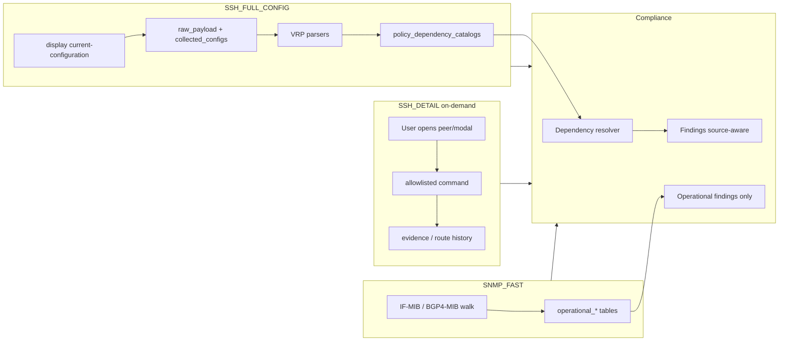

# Hybrid Collection Architecture (SNMP + SSH)

**Status:** H1 — design only (no live collection in this phase)  
**Audience:** NetOps backend, compliance, UI, NOC  
**Related:** `docs/DEVICE_DISCOVERY_ARCHITECTURE.md`, `docs/SSH_SNMP_FALLBACK_FLOW.md`, `docs/DISCOVERY_PERSISTENCE_MODEL.md`

---

## 1. Problem statement

NetOps today can persist discovery snapshots, `collected_configs.raw_config`, and SNMP rows, but consumers (compliance, dashboards) do not always know **which layer** produced a fact or whether that fact is **fresh**. A stale `parsed_config` embedded in `discovery_snapshots.snapshot_json` must not drive FAIL when `raw_config` exists and re-parse would yield FOUND.

**Goal:** three explicit collection layers with clear truth rules:

| Layer | Role | Cost | Cadence |
|-------|------|------|---------|
| **SNMP_FAST** | Operational state | Low | High (minutes–hours) |
| **SSH_FULL_CONFIG** | Config truth for compliance | Medium | Low (hours–days, manual window) |
| **SSH_DETAIL** | Investigation / modals | High per call | On demand only |

**Non-goals (H1):** new collectors, flags, scheduler changes, NetBox sync, bulk detail jobs.

---

## 2. Design principles

1. **No blind cache** — every surfaced value carries `source`, `collected_at`, `freshness_status`, and optional `collection_job_id` / `snapshot_id`.
2. **raw_config wins** — if `collected_configs.raw_config` (or full-config snapshot payload) exists, parsers MUST prefer it over embedded `parsed_config` / `snapshot_json` catalogs.
3. **parsed_config is derived** — cache for performance; rebuildable from raw; never primary for compliance MISSING/FAIL.
4. **Separate operational vs configurational compliance** — SNMP DOWN ≠ missing route-policy in config.
5. **Read-only default** — all SSH via vendor allowlist; no config mode; secrets redacted at persist.
6. **Additive discovery** — missing fresh peer/interface → warning, not silent delete (existing rule preserved).

---

## 3. Collection layers

### 3.1 SNMP_FAST

**Purpose:** Fast operational picture for NOC/dashboards.

**Collects (Huawei VRP v1 scope, extend per vendor):**

- Interfaces: `ifName`, `ifAlias`, `ifAdminStatus`, `ifOperStatus`, `ifSpeed`, HC counters (existing IF-MIB / ifXTable in `docs/netops/SNMP_READONLY_COLLECTION.md`).
- BGP (when MIB/agent supports): `bgpPeerState`, remote addr/AS, uptime, prefix counts where OID exists.
- Optional: `ifLastChange`, sysUpTime (device-level).

**Does not collect:** route-policies, prefix-lists, peer-group inheritance, L2VC config text, community definitions.

**Persistence target (new):** `operational_interfaces`, `operational_bgp_peers` (see §6).  
**Interim:** continue `snmp_snapshots` with `collector: "snmp"` until H2/H3 migration.

**UI:** “Operational · SNMP · collected &lt;time&gt; · fresh|stale”.

---

### 3.2 SSH_FULL_CONFIG

**Purpose:** Authoritative configuration snapshot for compliance and structured inventory.

**Commands (Huawei VRP — all via `validateReadonlyCommand` in `huawei-vrp/commands.ts`):**

| Scope | Command(s) |
|-------|------------|
| Full running config | `display current-configuration` |
| Interface block (optional slice) | `display current-configuration interface` |
| BGP block (optional slice) | `display current-configuration configuration bgp` |

Vendor adapters may map equivalents (e.g. Cisco `show running-config`) under separate allowlist profiles.

**Persist:**

- `collection_snapshots` row: `source=ssh_full_config`, `scope=full_config`, `raw_payload` = full text (or pointer to `collected_configs.id`).
- `collected_configs.raw_config` — **keep** as compatibility alias; new writes should link `collection_snapshot_id`.

**Parser outputs (into `parsed_payload` / normalized catalogs):**

- Interfaces, subinterfaces, dot1q, VRF/VPN-instance bindings
- BGP root peers + address-family params (`bgp-peer-dependency-parser`)
- Route-policies, `ip-prefix`, `ipv6-prefix`, community-filter/list, as-path-filter, extcommunity-filter
- L2VC / VSI / VPLS / VE-group (L2 parser modules)

**Compliance:** ONLY this layer (plus manual upload of same shape) may produce configurational MISSING.

**Cadence:** scheduled off-peak, manual “Collect config”, or post-change trigger — not per-page-load.

---

### 3.3 SSH_DETAIL

**Purpose:** Deep dive for a single object; never replaces full-config snapshot.

**Examples (allowlisted, per-object substitution):**

```
display bgp peer <peer> verbose
display bgp routing-table peer <peer> received-routes
display bgp routing-table peer <peer> advertised-routes
display interface <ifname>
display current-configuration interface <ifname>
display mpls l2vc
display mpls l2vc interface <ifname>
display vsi name <name> verbose
display mac-address vlan <vlan>
display mac-address vsi <name>
```

**Rules:**

- Triggered by UI action or explicit API (`POST .../detail`) with `device_id` + target key.
- Timeout bounded; output sanitized; stored as `collection_snapshots` with `scope=detail:<kind>` or `discovery_evidence` row linked to parent snapshot.
- **Bulk detail forbidden** without elevated approval + audit (see `SAFE_COLLECTION_CHECKLIST.md`).
- Route table queries may write `bgp_route_history` (existing) — not merged into compliance catalogs.

---

## 4. Freshness model

Every fact exposed to UI/compliance carries:

| Field | Type | Notes |
|-------|------|-------|
| `source` | enum | `snmp` \| `ssh_full_config` \| `ssh_detail` \| `manual_upload` |
| `collected_at` | timestamptz | wall time of successful collect |
| `freshness_status` | enum | `fresh` \| `stale` \| `expired` \| `unknown` |
| `collection_job_id` | FK optional | links run orchestration |
| `device_id` | FK | |
| `parser_version` | string | e.g. `huawei-vrp-v1`, `COMPLIANCE_PARSER_VERSION` |
| `raw_snapshot_id` | FK optional | `collection_snapshots.id` or `discovery_snapshots.id` |

**TTL policy (defaults, configurable per profile):**

| Layer | fresh | stale | expired |
|-------|-------|-------|---------|
| SNMP_FAST | &lt; 15 min | 15 min – 2 h | &gt; 2 h |
| SSH_FULL_CONFIG | &lt; 24 h | 1–7 d | &gt; 7 d |
| SSH_DETAIL | &lt; 1 h | 1–24 h | &gt; 24 h (detail is point-in-time) |

`unknown` = never collected for that dimension, or collect failed with no prior good row.

**Compliance extension:** finding metadata adds `configSource`, `configSnapshotId`, `operationalSource`, `operationalCollectedAt` — distinct from finding-level `freshness` (engine version / job supersession) already in `routes/compliance.ts`.

---

## 5. Source of truth matrix

| Question | Primary | Secondary | Never |
|----------|---------|-----------|-------|
| Is peer Established? | SNMP_FAST | SSH_DETAIL verbose | parsed_config alone |
| Does peer have import policy in config? | SSH_FULL_CONFIG | — | SNMP |
| Does prefix-list GATEWAY-IPV6 exist? | SSH_FULL_CONFIG parser catalog | manual_upload | stale parsed_config |
| Received routes count now? | SSH_DETAIL or SNMP if OID exists | — | full-config |
| Interface admin/oper status? | SNMP_FAST | SSH_DETAIL `display interface` | config block only |
| L2VC binding configured? | SSH_FULL_CONFIG | SSH_DETAIL l2vc | SNMP |

**Conflict resolution:**

```
if raw_config present for device:
  parse(raw_config) → catalogs
else if collection_snapshots.raw_payload (ssh_full_config):
  parse(raw_payload)
else:
  catalogs = empty → compliance dependency checks → UNKNOWN (not FAIL)

parsed_config / snapshot_json:
  use only if hash matches raw snapshot OR explicit "derived_from_snapshot_id"
```

Implemented today (partial): `buildPolicyDependencyConfigFromSnapshot(snapshot, { rawConfig })` in `policy-dependency-pipeline.ts`. H4 formalizes this for all contexts.

---

## 6. Data model (target)

### 6.1 `collection_snapshots` (new, superset)

Unifies config and detail artifacts; does not replace `discovery_snapshots` until migration.

```sql
-- conceptual
id, device_id, source, scope, status,
collected_at, freshness_expires_at,
raw_payload text,           -- or FK collected_configs.id
parsed_payload jsonb,
parser_version, collection_job_id,
error_summary, content_hash
```

`scope` examples: `full_config`, `detail:bgp_peer`, `detail:interface`, `detail:l2vc`, `snmp_fast`.

### 6.2 `operational_interfaces` (new)

```sql
device_id, interface_name, if_index optional,
admin_status, oper_status, alias, speed,
in_octets, out_octets, last_change optional,
source='snmp', collection_snapshot_id, last_seen
```

### 6.3 `operational_bgp_peers` (new)

```sql
device_id, peer_address, afi_safi,
peer_state, remote_as, uptime_seconds,
accepted_prefixes, received_prefixes, advertised_prefixes,
source='snmp'|'ssh_detail', collection_snapshot_id, last_seen
```

### 6.4 `config_bgp_peers` (new, config plane)

```sql
device_id, peer_key, root_asn, description, peer_group,
afi_safi, enabled, import_policy, export_policy,
effective_policy_source,  -- 'peer'|'group'|'inherited'
snapshot_id, parser_version
```

Populated only from SSH_FULL_CONFIG parse (or manual_upload).

### 6.5 `policy_dependency_catalogs` (new or embedded in snapshot)

Per-device, per-snapshot JSON blobs:

`route_policies`, `ip_prefixes`, `ipv6_prefixes`, `community_filters`, `community_lists`, `as_path_filters`, `extcommunity_filters`.

Today equivalent: `parseHuaweiPolicyDependencyPipeline` → `catalogs` + `catalog_status`. H4 persists explicitly keyed by `snapshot_id`.

### 6.6 Existing tables — mapping

| Existing | Hybrid role |
|----------|-------------|
| `collected_configs` | SSH_FULL_CONFIG storage (keep; link to `collection_snapshots`) |
| `discovery_snapshots` | Normalized discovery run output; migrate toward `collection_snapshots.parsed_payload` |
| `discovery_runs` / `discovery_evidence` | Orchestration + per-command evidence (detail + full-config slices) |
| `snmp_snapshots` | SNMP_FAST until `operational_*` populated |
| `bgp_route_history` | SSH_DETAIL route queries only |

---

## 7. Pipeline (recommended order)



1. **SNMP fast** — update operational tables; dashboards read here first.
2. **SSH full-config** — scheduled/manual; triggers parser + catalog persist.
3. **Dependency resolver** — FOUND / MISSING / UNKNOWN from catalogs; never FAIL on empty catalog without raw attempt.
4. **SSH detail** — user-driven; enriches UI; optional operational override when SNMP gap.

---

## 8. Domain rules

### 8.1 BGP

| Data | SNMP_FAST | SSH_FULL_CONFIG | SSH_DETAIL |
|------|-----------|-----------------|------------|
| peer state | yes | — | verbose |
| remote AS | often | root `as-number` | verbose |
| import/export policy names | no | family + group inheritance | verbose |
| prefix counts | OID if present | — | routing-table |
| idle reason | no | — | verbose |

Parser: `bgp-peer-dependency-parser.ts` (root vs `ipv4-family` / `ipv6-family`).

### 8.2 Interfaces

| Data | SNMP_FAST | SSH_FULL_CONFIG | SSH_DETAIL |
|------|-----------|-----------------|------------|
| up/down | yes | config line | `display interface` |
| alias | ifAlias | description | counters/errors |
| IP/VLAN/VRF | no | full block | subinterface cfg |
| CRC/flap | counters partial | — | detail |

### 8.3 L2

| Data | SNMP_FAST | SSH_FULL_CONFIG | SSH_DETAIL |
|------|-----------|-----------------|------------|
| port up/down | yes | — | — |
| dot1q / L2VC / VSI | no | parser | mpls l2vc / vsi verbose |
| MAC table | rare | — | mac-address commands |

Align with `docs/l2-circuits/` and L2 SSH allowlist (`L2_SSH_COMMANDS`).

---

## 9. Compliance behavior

Findings MUST declare plane and source in message/metadata:

| Example | Plane | Source |
|---------|-------|--------|
| `Peer 10.0.0.1 state=Idle` | operational | `snmp` snapshot #123 |
| `Route-policy RP-X references ipv6-prefix GATEWAY-IPV6: FOUND` | configurational | `ssh_full_config` snapshot #61 |
| `ipv6_prefixes catalog unavailable` | configurational | **UNKNOWN** (not FAIL) |
| `Peer configured without import policy` | configurational | `ssh_full_config` |

**Do not mix:** operational FAIL from SNMP stale data with configurational MISSING from old parsed_config.

Policy keys (future): prefix `operational-*` vs `config-*` in `policyKey`.

---

## 10. UI requirements (H7)

Per device / peer / interface / circuit:

- Last SNMP fast time + freshness badge
- Last full-config time + “Compliance based on snapshot #N (&lt;date&gt;)”
- Stale/expired banner when compliance run uses expired snapshot
- “Load detail” button → SSH_DETAIL with spinner + audit log
- Cache warning when showing data older than TTL
- No auto full-config on page load

---

## 11. Security (summary)

See `docs/collection/SAFE_COLLECTION_CHECKLIST.md`.

- SSH: read-only allowlist only (`huawei-vrp/commands.ts`)
- Block: `system-view`, `undo`, `reset`, `save`, `commit`, `reboot`, `format`, etc.
- Secrets redacted in `discovery_evidence` and stored raw_config access controlled
- Detail: per-request timeout, rate limit, audit event

---

## 12. Relationship to current code

| Component | Today | Target |
|-----------|-------|--------|
| `CollectionOrchestrator` | merges SNMP + SSH discovery | split schedules: fast vs full |
| `buildPolicyDependencyConfigFromSnapshot` | rawConfig optional | always pass raw when present |
| `compliance-engine` | loads latest snapshot + collected_configs | bind explicit `configSnapshotId` |
| `snmp_snapshots` | mixed snmp/ssh label | snmp-only fast path |
| Finding freshness | engine/parser version | + collection TTL freshness |

---

## 13. Out of scope (explicit)

- NetBox as collection source (read-only sync stays separate)
- Config push / provisioning
- Automatic mass `received-routes` walk
- Non-Huawei vendors in H2–H4 (adapter interface only in contracts)

---

## 14. References

- `workspace/artifacts/api-server/src/modules/netops/huawei-vrp/commands.ts` — allowlist
- `workspace/artifacts/api-server/src/modules/netops/device-discovery/` — orchestrator
- `workspace/artifacts/api-server/src/modules/netops/huawei-vrp/parsers/policy-dependency-pipeline.ts`
- `reports/compliance/PHASE_COMPLIANCE_PREFIX_PEER_RUNTIME_SMOKE_REPORT.md` — raw_config re-parse validation
